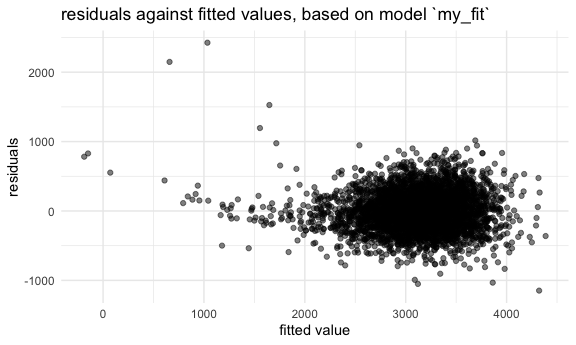
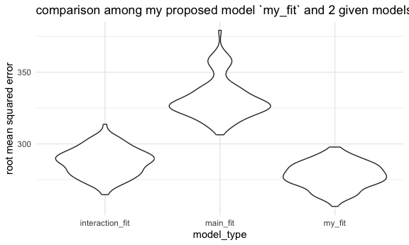

p8105_hw6_sp4170
================
Shihui Peng
2023-12-02

load packages and basic settings..

# Problem 2

## load Central Park weather data

``` r
weather_df = 
  rnoaa::meteo_pull_monitors(
    c("USW00094728"),
    var = c("PRCP", "TMIN", "TMAX"), 
    date_min = "2022-01-01",
    date_max = "2022-12-31") |>
  mutate(
    name = recode(id, USW00094728 = "CentralPark_NY"),
    tmin = tmin / 10,
    tmax = tmax / 10) |>
  select(name, id, everything())
```

    ## using cached file: /Users/peng_/Library/Caches/org.R-project.R/R/rnoaa/noaa_ghcnd/USW00094728.dly

    ## date created (size, mb): 2023-10-12 05:40:09.606797 (8.534)

    ## file min/max dates: 1869-01-01 / 2023-10-31

## draw 5000 samples from weather_df

I first create a function for sampling rows with size as large as 100%
of the weather_df from weather_df. Then i iterate and create 5000
samples from weather_df using this function.

``` r
boot_samp = function(df){
  sample_frac(df, replace = TRUE)
}

boot_strap =
  tibble(
    strap_number = 1:5000
  ) |> 
  mutate(
    strap_sample = map(strap_number, \(i) boot_samp(weather_df))
  )
```

## question 1: log(beta1_hat∗beta2_hat)

i first fit a linear regression model with y = tmax and covariants
including tmin and prcp for my created 5000 samples. Then i use
broom::tidy and unnest() to get estimates for tmins and prcps, select
relevant columns and unnest the list. I use pivot_wider to allow the
calculation between different rows within one column (that is, calculate
log of products of estimates of tmin and estiamtes of prcps). then, i
use mutate to calculate log(beta1_hat x beta2_hat), and draw a density
plot based on the estimates of log(beta1_hat x beta2_hat). then, i
calculate the 95%CI for log(beta1_hat x beta2_hat) estimates.

### fit linear regression and get log(beta1_hat∗beta2_hat) estimates

``` r
boot_result_para =
  boot_strap |> 
  mutate(
    model = map(strap_sample, \(df) lm(tmax ~ tmin + prcp, data = df)),
    result_para = map(model, broom::tidy)
  ) |> 
  select(strap_number, result_para) |> 
  unnest(result_para) |> 
  select(strap_number, term, estimate) |> 
  pivot_wider(
    names_from = term,
    values_from = estimate
  ) |> 
  mutate(
    log_b1b2 = log(tmin * prcp)
  )
```

    ## Warning: There was 1 warning in `mutate()`.
    ## ℹ In argument: `log_b1b2 = log(tmin * prcp)`.
    ## Caused by warning in `log()`:
    ## ! NaNs produced

``` r
# or this method????

boot_result_para =
  bootstrap(weather_df, 5000, id = "strap_number") |> 
  mutate(
    model = map(strap, \(df) lm(tmax ~ tmin + prcp, data = df)),
    result_para = map(model, broom::tidy)
  ) |> 
  select(strap_number, result_para) |> 
  unnest(result_para) |> 
  select(strap_number, term, estimate) |> 
  pivot_wider(
    names_from = term,
    values_from = estimate
  ) |> 
  mutate(
    log_b1b2 = log(tmin * prcp)
  )
```

    ## Warning: There was 1 warning in `mutate()`.
    ## ℹ In argument: `log_b1b2 = log(tmin * prcp)`.
    ## Caused by warning in `log()`:
    ## ! NaNs produced

### draw a density plot for log(beta1_hat\*beta2_hat) distribution

``` r
boot_result_para |> 
  ggplot(aes(x = log_b1b2)) + geom_density() +
  labs(x = "log(beta1_hat*beta2_hat)")
```

    ## Warning: Removed 3304 rows containing non-finite values (`stat_density()`).


descriptions:

- the distribution of the log(beta1_hat x beta2_hat) is highly
  left-skewed.
- the peak of the log(beta1_hat x beta2_hat) distribution is around
  -5.5, and the majority of the estimated log(beta1_hat x beta2_hat)
  value lies between -8.2 and -4.2.
- it is worth to notice that some values of beta1_hat x beta2_hat is
  negative, so we cannot calculate the log of them. in this case, this
  part of data is removed when we draw the density plot for estimated
  log(beta1_hat x beta2_hat).
  - for more details, 1696 out of 5000 rows are used when drawing the
    plot.

### calculate 95%CI for r^2 estimates

``` r
para_ci =
boot_result_para |> 
  mutate(
    log_b1b2_lower_ci = quantile(log_b1b2, 0.025, na.rm = TRUE),
    log_b1b2_upper_ci = quantile(log_b1b2, 0.975, na.rm = TRUE)
  ) |> 
  select(log_b1b2_lower_ci, log_b1b2_upper_ci) |> 
  distinct() 
```

- based on the output, we can tell the 95% confidence interval for
  log(beta1_hat x beta2_hat), which i use 2.5% and 97.5% quantiles to
  get, is from -8.8847595 to -4.6039854

## question 2: r^2

i first fit a linear regression model with y = tmax and covariants
including tmin and prcp for my created 5000 samples. then, i use
broom::glance to give r^2 values, select relevant columns and unnest the
list. then, i draw a density plot based on the estimates of r^2. then, i
calculate the 95%CI for r^2 estimates.

### fit linear regression and get r^2 estimates

``` r
boot_result_r2 =
  boot_strap |> 
  mutate(
    model = map(strap_sample, \(df) lm(tmax ~ tmin + prcp, data = df)),
    result_r2 = map(model, broom::glance)
  ) |> 
  select(strap_number, result_r2) |> 
  unnest(result_r2) 
```

### draw a density plot for r^2 distribution

``` r
boot_result_r2 |> 
  ggplot(aes(x = r.squared)) + geom_density() 
```


descriptions:

- the distribution of r^2 is slightly left-skewed.
- the peak of the r^2 distribution is around 0.916, and the majority of
  the estimated r^2 value lies between 0.886 and 0.932.

### calculate 95%CI for r^2 estimates

``` r
r2_ci =
boot_result_r2 |> 
  mutate(
    r2_lower_ci = quantile(r.squared, 0.025),
    r2_upper_ci = quantile(r.squared, 0.975)
  ) |> 
  select(r2_lower_ci, r2_upper_ci) |> 
  distinct()
```

- based on the output, we can tell the 95% confidence interval for r^2,
  which i use 2.5% and 97.5% quantiles to get, is from 0.8885495 to
  0.9406812
- since the 95%CI is not wide and with relatively large value, we might
  say the model can make good prediction when we do bootstrap to infer
  r^2

# Problem 3

## data import, clean, and mutate

``` r
bw_df = 
  read_csv("data/birthweight.csv") |> 
  janitor::clean_names() |> 
  mutate(
    babysex = factor(babysex, levels = c(1,2), labels = c("male", "female")),
    malform = case_when(malform == 0 ~ "absent", malform == 1 ~ "present"),
    mrace = factor(mrace, levels = c(1,2,3,4,8), labels = c("White", "Black", "Asian", "Puerto Rican", "Other")),
    frace = factor(frace, levels = c(1,2,3,4,8,9), labels = c("White", "Black", "Asian", "Puerto Rican", "Other", "Unknow"))
  ) |> 
  drop_na(bwt)
```

    ## Rows: 4342 Columns: 20
    ## ── Column specification ────────────────────────────────────────────────────────
    ## Delimiter: ","
    ## dbl (20): babysex, bhead, blength, bwt, delwt, fincome, frace, gaweeks, malf...
    ## 
    ## ℹ Use `spec()` to retrieve the full column specification for this data.
    ## ℹ Specify the column types or set `show_col_types = FALSE` to quiet this message.

``` r
colSums(is.na(bw_df))
```

    ##  babysex    bhead  blength      bwt    delwt  fincome    frace  gaweeks 
    ##        0        0        0        0        0        0        0        0 
    ##  malform menarche  mheight   momage    mrace   parity  pnumlbw  pnumsga 
    ##        0        0        0        0        0        0        0        0 
    ##    ppbmi     ppwt   smoken   wtgain 
    ##        0        0        0        0

- i import the data, clean the names, and mutate my interested columns
  for further steps. I drop NULL in bwt column as this is our response
  variable. then, i check the missing value in other columns, and find
  that there are no missing data.

## fit my model

- step 1
  - from my opinion, i suppose the main effect of (1) presence of
    malformations that could affect weight (malform), (2) mother’s race
    (mrace), (3) father’s race (frace), (4) average number of cigarettes
    smoked per day during pregnancy (smoken), (5) gestational age in
    weeks (gaweeks), and (6) baby’s head circumference at birth (bhead),
    will affect the baby’s birth weight. therefore, i fit a mixed linear
    regression model `fit1`
  - but i find that the r^2 is pretty low, so i decide to add a new
    covariant.
- step 2
  - i decide to add one more covariant (7) baby’s length at birth
    (blength) into the model `fit1`, and the new model is `fit2`
  - r^2 greatly increase, so i decide to keep variable `blength` into my
    mode.
- step 3
  - based on step 2 parameter estimates output, i find that the variable
    `malform` is not significant. so, i remove it from the model, and
    find that the r^2 does not change. To keep my model less complex, i
    decide to remove the variable `malform`, and here it comes my final
    model `fit`: `bwt ~ mrace + frace + smoken + gaweeks + blength`

``` r
fit1 = lm(bwt ~ malform + mrace + frace + smoken + gaweeks + bhead, data = bw_df)

broom::tidy(fit1) |> knitr::kable()
```

| term              |     estimate |   std.error |   statistic |   p.value |
|:------------------|-------------:|------------:|------------:|----------:|
| (Intercept)       | -4659.384566 | 109.9647102 | -42.3716350 | 0.0000000 |
| malformpresent    |   -14.977573 |  83.5763128 |  -0.1792083 | 0.8577825 |
| mraceBlack        |  -194.736141 |  54.4305175 |  -3.5777014 | 0.0003504 |
| mraceAsian        |  -182.247182 |  84.8350742 |  -2.1482528 | 0.0317490 |
| mracePuerto Rican |  -160.548822 |  53.1307790 |  -3.0217668 | 0.0025277 |
| fraceBlack        |    27.171032 |  54.4797970 |   0.4987359 | 0.6179908 |
| fraceAsian        |    47.033933 |  82.0279874 |   0.5733888 | 0.5664112 |
| fracePuerto Rican |   -17.060785 |  52.8424708 |  -0.3228612 | 0.7468159 |
| fraceOther        |   -32.937455 |  87.6120679 |  -0.3759466 | 0.7069750 |
| smoken            |    -5.995572 |   0.6901144 |  -8.6877946 | 0.0000000 |
| gaweeks           |    22.022726 |   1.6918945 |  13.0166069 | 0.0000000 |
| bhead             |   208.477654 |   3.3290821 |  62.6231647 | 0.0000000 |

``` r
broom::glance(fit1) |> knitr::kable()
```

| r.squared | adj.r.squared |    sigma | statistic | p.value |  df |   logLik |      AIC |      BIC |  deviance | df.residual | nobs |
|----------:|--------------:|---------:|----------:|--------:|----:|---------:|---------:|---------:|----------:|------------:|-----:|
| 0.6036449 |      0.602638 | 322.8448 |  599.5043 |       0 |  11 | -31239.5 | 62505.01 | 62587.89 | 451310614 |        4330 | 4342 |

``` r
fit2 = lm(bwt ~ malform + mrace + frace + smoken + gaweeks + bhead + blength, data = bw_df)

broom::tidy(fit2) |> knitr::kable()
```

| term              |      estimate |  std.error |   statistic |   p.value |
|:------------------|--------------:|-----------:|------------:|----------:|
| (Intercept)       | -5726.1559583 | 98.8518817 | -57.9266257 | 0.0000000 |
| malformpresent    |    22.2738598 | 72.1309722 |   0.3087974 | 0.7574905 |
| mraceBlack        |  -177.1447619 | 46.9745413 |  -3.7710802 | 0.0001647 |
| mraceAsian        |  -147.2388127 | 73.2164138 |  -2.0110083 | 0.0443865 |
| mracePuerto Rican |   -99.5635533 | 45.8779782 |  -2.1701818 | 0.0300473 |
| fraceBlack        |    38.7779222 | 47.0158152 |   0.8247846 | 0.4095393 |
| fraceAsian        |    32.1012536 | 70.7893854 |   0.4534755 | 0.6502291 |
| fracePuerto Rican |   -38.5741154 | 45.6052913 |  -0.8458254 | 0.3976969 |
| fraceOther        |    -0.7514897 | 75.6118745 |  -0.0099388 | 0.9920706 |
| smoken            |    -4.3528410 |  0.5970769 |  -7.2902519 | 0.0000000 |
| gaweeks           |    12.8290725 |  1.4794281 |   8.6716432 | 0.0000000 |
| bhead             |   134.0285760 |  3.4620317 |  38.7138502 | 0.0000000 |
| blength           |    78.6374892 |  2.0405140 |  38.5380792 | 0.0000000 |

``` r
broom::glance(fit2) |> knitr::kable()
```

| r.squared | adj.r.squared |    sigma | statistic | p.value |  df |    logLik |      AIC |      BIC |  deviance | df.residual | nobs |
|----------:|--------------:|---------:|----------:|--------:|----:|----------:|---------:|---------:|----------:|------------:|-----:|
| 0.7048904 |     0.7040724 | 278.6079 |  861.6773 |       0 |  12 | -30599.14 | 61226.27 | 61315.54 | 336027171 |        4329 | 4342 |

``` r
my_fit = lm(bwt ~ mrace + frace + smoken + gaweeks + blength + bhead, data = bw_df)

broom::tidy(my_fit) |> knitr::kable()
```

| term              |      estimate |  std.error |   statistic |   p.value |
|:------------------|--------------:|-----------:|------------:|----------:|
| (Intercept)       | -5725.9057446 | 98.8382343 | -57.9320926 | 0.0000000 |
| mraceBlack        |  -177.1432250 | 46.9696338 |  -3.7714415 | 0.0001645 |
| mraceAsian        |  -147.2672993 | 73.2087070 |  -2.0116091 | 0.0443230 |
| mracePuerto Rican |   -99.6215515 | 45.8728010 |  -2.1716911 | 0.0299331 |
| fraceBlack        |    38.7201926 | 47.0105319 |   0.8236493 | 0.4101842 |
| fraceAsian        |    32.0317712 | 70.7816326 |   0.4525435 | 0.6509001 |
| fracePuerto Rican |   -38.6269181 | 45.6002064 |  -0.8470777 | 0.3969986 |
| fraceOther        |    -0.8773302 | 75.6028774 |  -0.0116045 | 0.9907417 |
| smoken            |    -4.3480255 |  0.5968109 |  -7.2854329 | 0.0000000 |
| gaweeks           |    12.8250909 |  1.4792173 |   8.6701869 | 0.0000000 |
| blength           |    78.6290453 |  2.0401176 |  38.5414278 | 0.0000000 |
| bhead             |   134.0409461 |  3.4614383 |  38.7240608 | 0.0000000 |

``` r
broom::glance(my_fit) |> knitr::kable()
```

| r.squared | adj.r.squared |    sigma | statistic | p.value |  df |    logLik |      AIC |      BIC |  deviance | df.residual | nobs |
|----------:|--------------:|---------:|----------:|--------:|----:|----------:|---------:|---------:|----------:|------------:|-----:|
| 0.7048839 |     0.7041342 | 278.5788 |  940.1993 |       0 |  11 | -30599.18 | 61224.37 | 61307.26 | 336034572 |        4330 | 4342 |

## show a plot of model residuals against fitted values based on my model `fit`

``` r
bw_df |> 
  select(bwt, mrace, frace, smoken, gaweeks, blength, bhead) |> 
  add_predictions(my_fit) |> 
  add_residuals(my_fit) |> 
  ggplot(aes(y = resid, x = pred)) + geom_point(alpha = 0.5) +
  labs(x = "fitted value", y = "residuals", title = "residuals against fitted values, based on model `my_fit`")
```



- based on this plot, we can see some fitted values have large
  residuals, so maybe there are outliers when we use model fit for
  prediction. Since some residuals are pretty large, we cannot say that
  the model fit is the best fitted model for this dataset.

## compare my model `fit` with other two models

### build & have a look at the other 2 models

i build two models. model `main_fit` is using length at birth and
gestational age as predictors (main effects only). model `inter_fit` is
using head circumference, length, sex, and all interactions (including
the three-way interaction) between these. just take a look of these two
models:

``` r
main_fit = lm(bwt ~ blength + gaweeks, data = bw_df)

interaction_fit = lm(bwt ~ bhead * babysex * blength, data = bw_df)
```

### comparison between these three models

i use crossv_mc to create training sets and testing sets, and then
convert resamples into tibbles.

``` r
cv_df =
  bw_df |> 
  crossv_mc(n = 100) |> 
  mutate(
    train = map(train, as.tibble),
    test = map(test, as.tibble)
  )
```

    ## Warning: There was 1 warning in `mutate()`.
    ## ℹ In argument: `train = map(train, as.tibble)`.
    ## Caused by warning:
    ## ! `as.tibble()` was deprecated in tibble 2.0.0.
    ## ℹ Please use `as_tibble()` instead.
    ## ℹ The signature and semantics have changed, see `?as_tibble`.
    ## ℹ The deprecated feature was likely used in the purrr package.
    ##   Please report the issue at <https://github.com/tidyverse/purrr/issues>.

i apply each model to the training set dataframe, and evaluate all
testing set dataframe using root mean squared error (rmse).

``` r
cv_result =
  cv_df |>
  mutate(
    my_fit = map(train, \(df) lm(bwt ~ mrace + frace + smoken + gaweeks + blength + bhead, data = df)),
    main_fit = map(train, \(df) lm(bwt ~ blength + gaweeks, data = df)),
    interaction_fit = map(train, \(df) lm(bwt ~ bhead * babysex * blength, data = df))
  ) |> 
  mutate(
    rmse_my_fit = map2_dbl(my_fit, test, \(model, df) rmse(model, df)),
    rmse_main_fit = map2_dbl(main_fit, test, \(model, df) rmse(model, df)),
    rmse_interaction_fit = map2_dbl(interaction_fit, test, \(model, df) rmse(model, df))
  )
```

i draw a violin plot to show the root mean squared error for these three
models..

``` r
cv_result |> 
  select(starts_with("rmse")) |> 
  pivot_longer(
    everything(),
    names_to = 'model_type',
    values_to = 'rmse',
    names_prefix = 'rmse_'
  ) |> 
  ggplot(aes(x = model_type, y = rmse)) + geom_violin() +
  labs(
    title = "comparison among my proposed model `my_fit` and 2 given models",
    y = "root mean squared error"
  )
```



- based on the violin plot comparing my model and the other 2 given
  models, we can see:
  - the rmse of my model is less than the main_fit model without
    overlaps. theredfore, my proposed model is better than the main_fit
    model using length at birth and gestational age as predictors (main
    effects only) due to the smaller rmse. so the improvement of my
    model is pretty clear.
  - the rmse of my model is less than the interaction_fit mode, but the
    part of the distributions have overlapped. therefore, my proposed
    model might be better than the interaction_fit model using head
    circumference, length, sex, and all interactions, but the
    improvement is not really clear.
