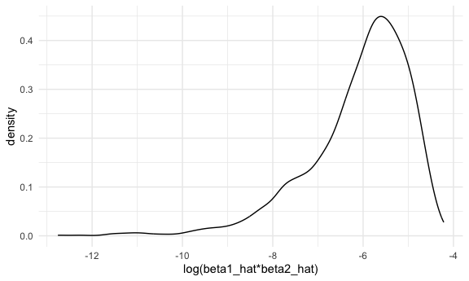

p8105_hw6_sp4170
================
Shihui Peng
2023-12-02

load packages and basic settings..

# Problem 2

## load Central Park weather data

``` r
weather_df = 
  rnoaa::meteo_pull_monitors(
    c("USW00094728"),
    var = c("PRCP", "TMIN", "TMAX"), 
    date_min = "2022-01-01",
    date_max = "2022-12-31") |>
  mutate(
    name = recode(id, USW00094728 = "CentralPark_NY"),
    tmin = tmin / 10,
    tmax = tmax / 10) |>
  select(name, id, everything())
```

    ## using cached file: /Users/peng_/Library/Caches/org.R-project.R/R/rnoaa/noaa_ghcnd/USW00094728.dly

    ## date created (size, mb): 2023-10-12 05:40:09.606797 (8.534)

    ## file min/max dates: 1869-01-01 / 2023-10-31

## draw 5000 samples from weather_df

I first create a function for sampling rows with size as large as 100%
of the weather_df from weather_df. Then i iterate and create 5000
samples from weather_df using this function.

``` r
boot_samp = function(df){
  sample_frac(df, replace = TRUE)
}

boot_strap =
  tibble(
    strap_number = 1:5000
  ) |> 
  mutate(
    strap_sample = map(strap_number, \(i) boot_samp(weather_df))
  )
```

## question 1: log(beta1_hat∗beta2_hat)

i first fit a linear regression model with y = tmax and covariants
including tmin and prcp for my created 5000 samples. Then i use
broom::tidy and unnest() to get estimates for tmins and prcps, select
relevant columns and unnest the list. I use pivot_wider to allow the
calculation between different rows within one column (that is, calculate
log of products of estimates of tmin and estiamtes of prcps). then, i
use mutate to calculate log(beta1_hat x beta2_hat), and draw a density
plot based on the estimates of log(beta1_hat x beta2_hat). then, i
calculate the 95%CI for log(beta1_hat x beta2_hat) estimates.

### fit linear regression and get log(beta1_hat∗beta2_hat) estimates

``` r
boot_result_para =
  boot_strap |> 
  mutate(
    model = map(strap_sample, \(df) lm(tmax ~ tmin + prcp, data = df)),
    result_para = map(model, broom::tidy)
  ) |> 
  select(strap_number, result_para) |> 
  unnest(result_para) |> 
  select(strap_number, term, estimate) |> 
  pivot_wider(
    names_from = term,
    values_from = estimate
  ) |> 
  mutate(
    log_b1b2 = log(tmin * prcp)
  )
```

    ## Warning: There was 1 warning in `mutate()`.
    ## ℹ In argument: `log_b1b2 = log(tmin * prcp)`.
    ## Caused by warning in `log()`:
    ## ! NaNs produced

### draw a density plot for log(beta1_hat\*beta2_hat) distribution

``` r
boot_result_para |> 
  ggplot(aes(x = log_b1b2)) + geom_density() +
  labs(x = "log(beta1_hat*beta2_hat)")
```

    ## Warning: Removed 3361 rows containing non-finite values (`stat_density()`).


descriptions:

- the distribution of the log(beta1_hat x beta2_hat) is highly
  left-skewed.
- the peak of the log(beta1_hat x beta2_hat) distribution is around
  -5.5, and the majority of the estimated log(beta1_hat x beta2_hat)
  value lies between -8.2 and -4.2.
- it is worth to notice that some values of beta1_hat x beta2_hat is
  negative, so we cannot calculate the log of them. in this case, this
  part of data is removed when we draw the density plot for estimated
  log(beta1_hat x beta2_hat).

### calculate 95%CI for r^2 estimates

``` r
para_ci =
boot_result_para |> 
  mutate(
    log_b1b2_lower_ci = quantile(log_b1b2, 0.025, na.rm = TRUE),
    log_b1b2_upper_ci = quantile(log_b1b2, 0.975, na.rm = TRUE)
  ) |> 
  select(log_b1b2_lower_ci, log_b1b2_upper_ci) |> 
  distinct() 
```

- based on the output, we can tell the 95% confidence interval for
  log(beta1_hat x beta2_hat), which i use 2.5% and 97.5% quantiles to
  get, is from -8.9815594 to -4.6016727

## question 2: r^2

i first fit a linear regression model with y = tmax and covariants
including tmin and prcp for my created 5000 samples. then, i use
broom::glance to give r^2 values, select relevant columns and unnest the
list. then, i draw a density plot based on the estimates of r^2. then, i
calculate the 95%CI for r^2 estimates.

### fit linear regression and get r^2 estimates

``` r
boot_result_r2 =
  boot_strap |> 
  mutate(
    model = map(strap_sample, \(df) lm(tmax ~ tmin + prcp, data = df)),
    result_r2 = map(model, broom::glance)
  ) |> 
  select(strap_number, result_r2) |> 
  unnest(result_r2) 
```

### draw a density plot for r^2 distribution

``` r
boot_result_r2 |> 
  ggplot(aes(x = r.squared)) + geom_density() 
```


descriptions:

- the distribution of r^2 is slightly left-skewed.
- the peak of the r^2 distribution is around 0.916, and the majority of
  the estimated r^2 value lies between 0.886 and 0.932.

### calculate 95%CI for r^2 estimates

``` r
r2_ci =
boot_result_r2 |> 
  mutate(
    r2_lower_ci = quantile(r.squared, 0.025),
    r2_upper_ci = quantile(r.squared, 0.975)
  ) |> 
  select(r2_lower_ci, r2_upper_ci) |> 
  distinct()
```

- based on the output, we can tell the 95% confidence interval for r^2,
  which i use 2.5% and 97.5% quantiles to get, is from 0.8885495 to
  0.9406812
